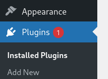
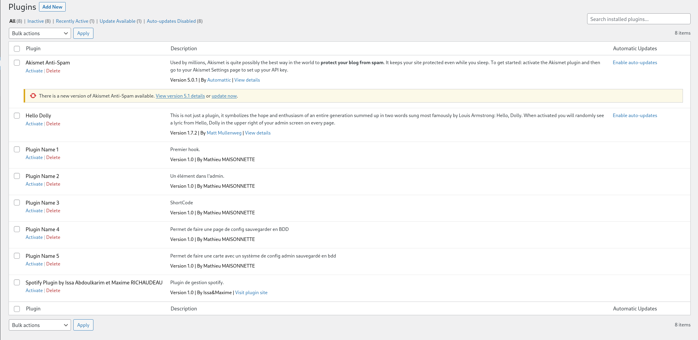
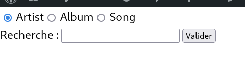
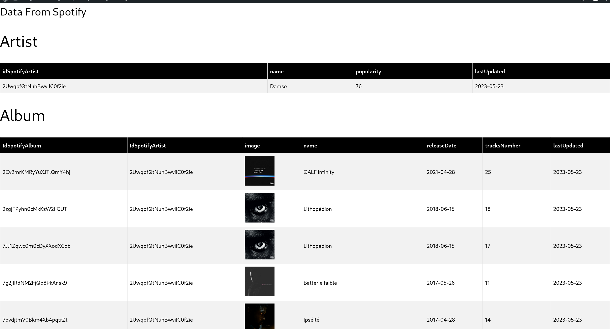
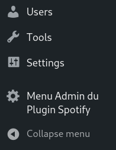
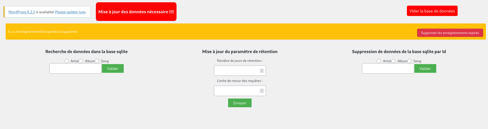

\newpage
# Documentation technique du plugin

## Prérequis

Afin d'utiliser ce plugin, vous devriez installer en amont :  

- Wordpress  


## Installation du plugin 

Suivez ces étapes pour installer le plugin

### Etape 1

Déposez le dossier contant votre plugin dans le dossier ```wordpress/wp-content/plugins``` de votre dossier wordpress
```
├── wp-content
│   ├── plugins
│   │   ├── akismet
│   │   │   ├── _inc
│   │   │   │   └── img
│   │   │   └── views
│   │   ├── mr_aim_plugin
│   │   │   └── includes
│   │   │       └── sqlitedb
│   │   ├── plugin1
│   │   ├── plugin2
│   │   │   └── includes
│   │   ├── plugin3
│   │   │   └── includes
│   │   ├── plugin4
│   │   │   └── includes
│   │   └── plugin5
│   │       └── includes
```

### Etape 2

Ensuite dans votre interface admin, cliquer sur plugins.  



Une fois cela accompli, recherchez le nom de votre plugin, en l'occurrence "mr_aim_plugin", et activez-le en cliquant sur ``activate`` ou l'équivalent en français. 



#### **Remarque**
   
Dans certains cas, il est possible que vous n'ayez pas les droits sur certains dossiers du plugin à l'instar du droit d’exécution pour ceux qui sont sous linux. Pour simplifier, nous vous recommandons de donner tous les droits sur le contenu du dossier ``mr_aim_plugin``.  
 Ainsi, si cela vous arrive, exécutez cette commande dans le dossier ``mr_aim_plugin`` :  

```bash  
sudo chmod 777 -R * 
```

## Utilisation
### Ajout de shortcode

Pour utiliser le plugins vous avez besoin d'un shortcode qui est votre point d'entrée au niveau des pages qui sont destiné à l'utilisateur. 

```bash  
[mr_aim_sc]
```

### Interface utilisateurs 

Lorsque le plugin est chargé, vous aurez plus ou moins une interface similaire à celle-ci (vous êtes libre de mettre le CSS que vous souhaitez) du côté utilisateur. 

 



Pour faire une recherche, sélectionnez le type que vous souhaitez : artiste, album ou chanson. 

Une fois la recherche effectuée, elle sera d'abord recherchée dans la base de données, et si l'information n'est pas présente, nous irons chercher dans la base de données Spotify.

### Interface admin

Dans l'interface admin de wordpress, vous trouverez une option nommé ``Menu Admin du plugin Spotify``. Cliquez sur ce dernier.



Ensuite, vous pouvez observez plusieurs options mise à disposition comme l'indique l'image ci-dessus. 



- Mise à jour des données : Ceci vous montre que certaines données ont dépassé la limite de rétention.
- Suppression des données : Ce bouton vous permet de supprimer les données dont la date de rétention est atteinte.
- Durée de rétention : Ce paramètre vous permet de définir le nombre de jours de rétention. Ainsi, par exemple, si vous mettez 10, au-delà des 10 jours, le système vous invitera à mettre à jour les données.
- Recherche des données dans la base : Comme pour l'interface utilisateur, on peut faire des recherches qui seront uniquement faites au niveau local.
- Vider toute la base de données : Il s'agit d'une fonctionnalité permettant de vider les tables auteurs, albums et songs.

- Suppression d'un éléments :  Pour supprimer un éléments (auteur, album ou song) pour devrez remplir l'id de l'élément en sélectionnant la bonne catégorie. 
